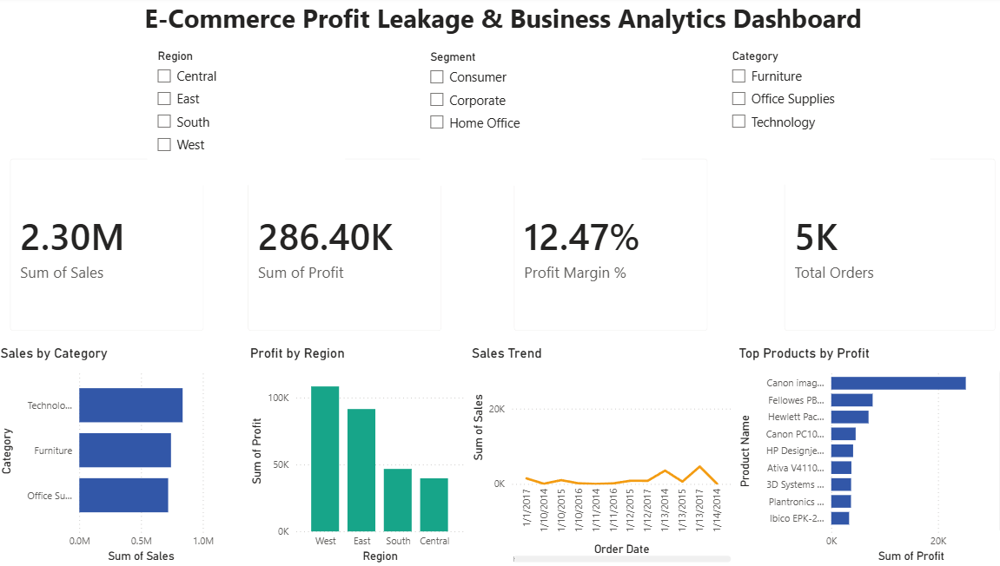

# E-Commerce Profit Leakage & Business Analytics Dashboard

## Dashboard Preview

## Project Overview

This project analyzes retail sales data from the Superstore dataset to identify profit leakage, optimize discount strategies, analyze customer behavior, and improve regional profitability.

## Key Features

- Executive KPI Dashboard
- Profit Leakage Analysis
- Top Loss-Making Products
- Loss-Making Subcategory Analysis
- Discount vs Profit Analysis
- Regional Profitability Analysis
- Customer Segmentation (RFM)
- Monthly Sales Trend Analysis
- Sales Forecasting Trend

## Technologies Used

- Power BI
- Python
- Pandas
- Plotly
- Jupyter Notebook
- Data Visualization
- Business Analytics
- GitHub

## Key Business Insights

- Technology category generated the highest sales.
- West region contributed the highest profit.
- Profit margin achieved: 12.47%.
- Identified top-performing products based on profit.
- Interactive filters allow analysis by Region, Segment, and Category.

## Dataset

Sample Superstore Dataset

## Author

Manasvi Bhargava
